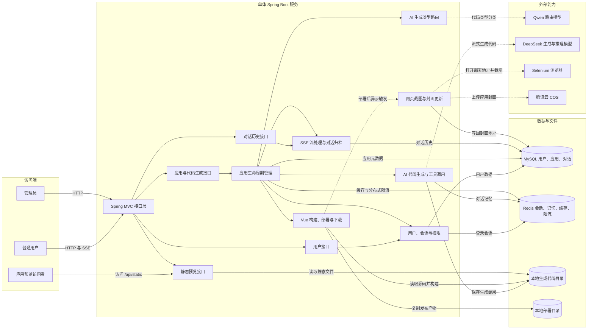
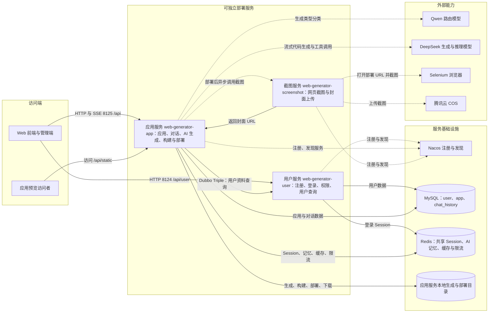

# WebGenerator

一个 AI 驱动的网站代码生成平台。用户输入自然语言描述后，系统会自动规划生成方式、流式产出网站代码，并支持在线预览、部署、下载与管理。

## 项目简介

WebGenerator 面向“用对话生成网站”这一场景，提供从提示词输入到代码生成、预览、部署的完整链路。用户只需描述想要的网站类型、风格和功能，系统即可自动完成代码生成、文件落盘、在线预览，以及一键部署与封面截图。

典型使用流程如下：

1. 用户在首页输入网站需求，系统创建应用并智能选择生成模式。
2. 进入对话页后，通过 SSE 与 AI 多轮交互，实时查看生成过程与页面效果。
3. 生成完成后可预览网站、下载源码，或一键部署为可访问链接。
4. 管理员可对应用进行精选、编辑和统一管理。

项目同时包含三种实现形态，便于对比不同架构下的业务组织方式：

| 形态 | 目录 | 说明 |
|------|------|------|
| 单体服务 | `src/` | Spring Boot 一体化应用，默认端口 `8123`，适合本地开发与快速验证 |
| LangGraph4j 工作流 | `src/.../langgraph4j/` | 基于状态图的节点化流程，支持素材采集、质检与条件分支 |
| 微服务架构 | `microservice/` | 用户、应用、截图服务拆分，基于 Dubbo Triple + Nacos 协作 |

### 核心能力

**代码生成**

- 支持三种生成模式：`HTML` 单页、`MULTI_FILE` 多文件静态站、`VUE_PROJECT` 完整 Vue 工程
- 创建应用时由 Qwen 模型自动路由最合适的生成类型
- Vue 工程模式支持 AI 工具调用（读/写/改/删文件、列目录等），可自主完成项目搭建
- 通过 SSE 流式返回生成内容，支持多轮对话持续优化

**应用管理**

- 应用创建、编辑、删除、分页查询与精选推荐
- 对话历史持久化，支持按应用游标分页加载
- 代码 ZIP 打包下载，部署后生成可访问 URL
- 部署完成自动截图并上传至对象存储，作为应用封面

**工作流增强（LangGraph4j）**

- AI 规划图片素材采集任务，并行调用 Pexels、unDraw、Mermaid、DashScope 等能力
- 将素材 URL 注入提示词，提升生成页面视觉效果
- AI 代码质量检查，失败时携带错误信息自动重试
- Vue 项目自动执行 `npm install` 与 `npm run build`

**平台能力**

- 用户注册、登录、Session 共享与管理员权限控制
- Redis 分布式限流，防止 AI 对话接口被滥用
- Prometheus 监控 AI 调用指标（token、耗时等）
- Knife4j 自动生成 API 文档

### 技术栈

#### 后端

| 类别 | 技术 |
|------|------|
| 语言与框架 | Java 21、Spring Boot 3.3、Spring MVC、Spring AOP |
| 数据访问 | MyBatis-Flex、MySQL、HikariCP |
| AI 能力 | LangChain4j 1.1、LangGraph4j 1.8、DeepSeek API、阿里云 DashScope（Qwen / 文生图） |
| 缓存与会话 | Redis、Spring Session、Caffeine 本地缓存、Redisson 分布式限流 |
| 对象存储 | 腾讯云 COS |
| 网页截图 | Selenium 4 + Chrome Headless |
| API 文档 | Knife4j（OpenAPI 3） |
| 监控 | Spring Actuator、Micrometer、Prometheus |
| 工具库 | Hutool、Lombok |

#### 微服务（`microservice/`）

| 类别 | 技术 |
|------|------|
| 服务拆分 | `user`（8124）、`app`（8125）、`screenshot`（8127） |
| RPC 框架 | Apache Dubbo 3.3（Triple 协议） |
| 注册中心 | Nacos |
| 共享模块 | `common`、`model`、`client`、`ai` |

#### 前端（`frontend/`）

| 类别 | 技术 |
|------|------|
| 框架 | Vue 3.5、TypeScript 5.8、Vite 7 |
| UI 组件 | Ant Design Vue 4 |
| 状态与路由 | Pinia 3、Vue Router 4 |
| HTTP | Axios |
| 内容渲染 | Markdown-it、Highlight.js |
| 代码规范 | ESLint、Prettier、vue-tsc |

#### 基础设施

| 组件 | 用途 |
|------|------|
| MySQL | 用户、应用、对话历史持久化 |
| Redis | 登录 Session、AI 对话记忆、精选应用缓存、分布式限流 |
| 腾讯云 COS | 应用封面截图、Mermaid 架构图存储 |
| Nacos | 微服务注册与发现 |
| Node.js / npm | Vue 项目构建（`npm install` + `npm run build`） |

### 项目结构

```
WebGenerator/
├── src/                    # 单体服务源码
│   └── main/java/com/zy/webgenerator/
│       ├── controller/     # REST API 接口层
│       ├── service/        # 业务服务层
│       ├── ai/             # LangChain4j AI 服务与工具
│       ├── core/           # 代码生成外观、解析、保存、构建
│       └── langgraph4j/    # LangGraph4j 工作流节点与工具
├── microservice/           # 微服务拆分方案
│   ├── user/               # 用户服务
│   ├── app/                # 应用与 AI 生成服务
│   ├── screenshot/         # 网页截图服务
│   ├── ai/                 # AI 能力共享模块
│   ├── common/             # 公共配置与工具
│   ├── model/              # 实体与 DTO
│   └── client/             # Dubbo 内部服务接口
├── frontend/               # Vue 3 前端
├── sql/                    # 数据库初始化脚本
└── docs/architecture/      # 架构图详细说明
```

## 架构图

以下架构图会在 GitHub 仓库首页直接渲染。

## 单体服务业务架构



[查看单体架构说明](docs/architecture/monolith-business-architecture.md)

## LangGraph4j 工作流业务架构


[查看工作流架构说明](docs/architecture/langgraph4j-workflow-architecture.md)

## 微服务业务架构



[查看微服务架构说明](docs/architecture/microservice-business-architecture.md)
