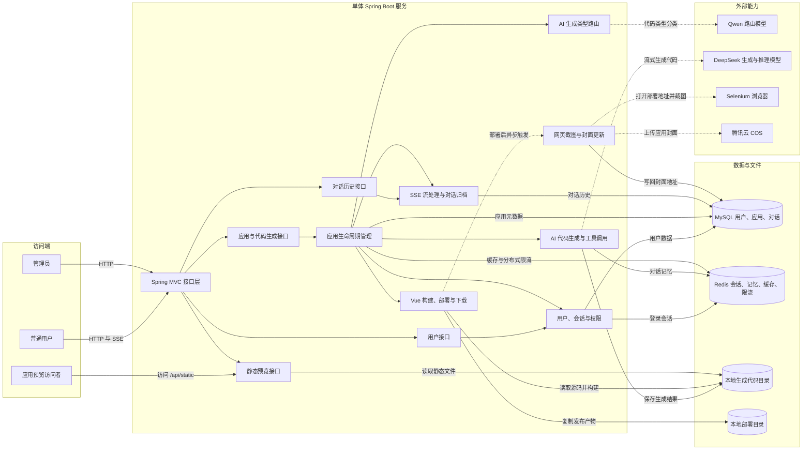
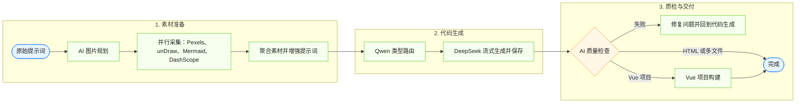
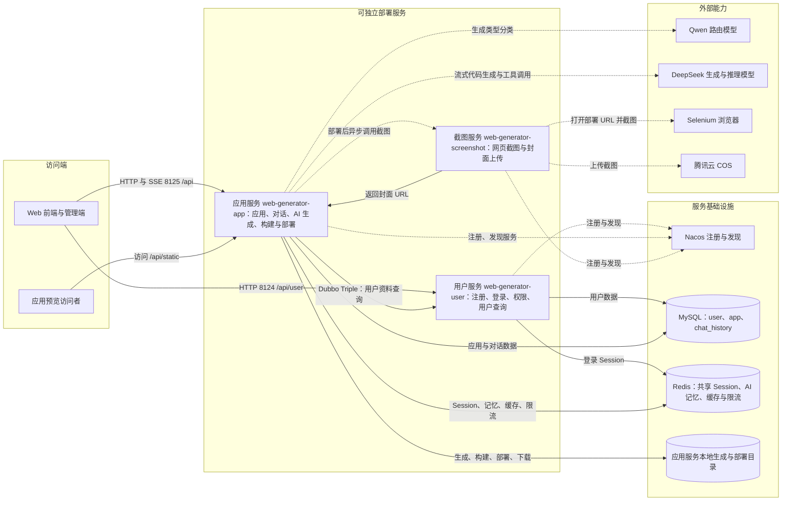

# WebGenerator

一个 AI 驱动的网站代码生成平台。用户输入自然语言描述后，系统会自动规划生成方式、流式产出网站代码，并支持在线预览、部署、下载与管理。

## 项目简介

WebGenerator 面向“用对话生成网站”这一场景，提供从提示词输入到代码生成、预览、部署的完整链路。项目同时包含三种实现形态，便于对比不同架构下的业务组织方式：

- **单体服务**：`src` 目录下的 Spring Boot 应用，适合快速开发与一体化部署。
- **LangGraph4j 工作流**：`langgraph4j` 包中的节点化流程，支持素材采集、提示词增强、代码生成、质量检查与 Vue 构建。
- **微服务架构**：`microservice` 目录下的用户、应用、截图服务拆分方案，基于 Dubbo + Nacos 协作。

### 核心能力

- 支持 `HTML`、`多文件` 和 `Vue 项目` 三种代码生成模式
- 通过 SSE 流式返回 AI 生成过程，支持多轮对话持续优化
- 提供应用创建、部署、下载、对话历史与精选应用管理
- 集成图片素材采集、智能路由、代码质检与网页截图封面

### 技术栈

- 后端：Java 21、Spring Boot、MyBatis-Flex、LangChain4j、LangGraph4j
- 前端：Vue 3、TypeScript、Ant Design Vue、Vite
- 基础设施：MySQL、Redis、腾讯云 COS、Nacos、Dubbo

## 架构图

以下架构图会在 GitHub 仓库首页直接渲染。

## 单体服务业务架构

[查看单体架构说明](docs/architecture/monolith-business-architecture.md)

## LangGraph4j 工作流业务架构

[查看工作流架构说明](docs/architecture/langgraph4j-workflow-architecture.md)

## 微服务业务架构

[查看微服务架构说明](docs/architecture/microservice-business-architecture.md)
