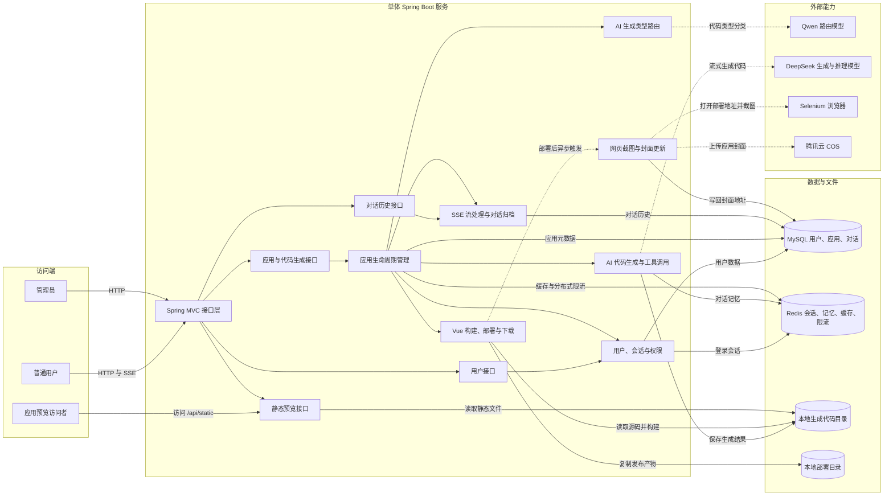
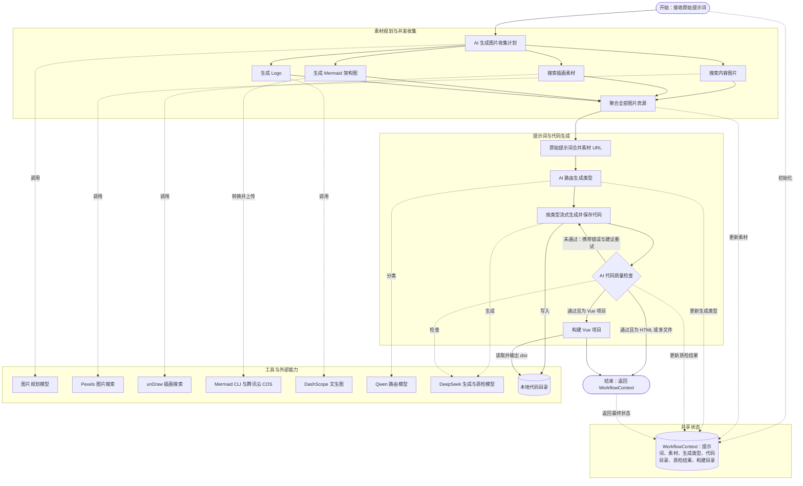
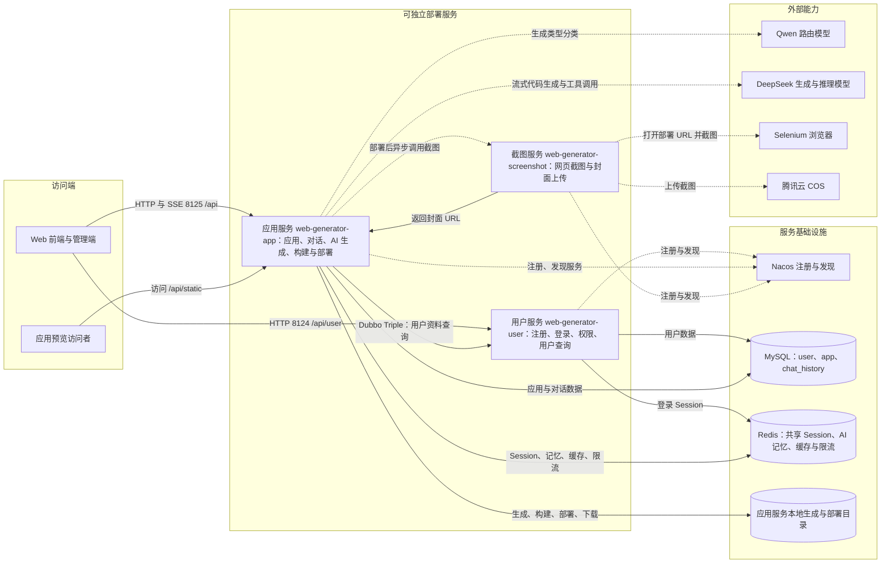

# WebGenerator

AI 驱动的网站代码生成项目。以下架构图会在 GitHub 仓库首页直接渲染。

## 单体服务业务架构

[查看单体架构说明](docs/architecture/monolith-business-architecture.md)

## LangGraph4j 工作流业务架构

[查看工作流架构说明](docs/architecture/langgraph4j-workflow-architecture.md)

## 微服务业务架构

[查看微服务架构说明](docs/architecture/microservice-business-architecture.md)
