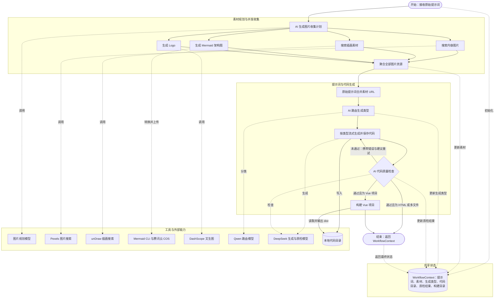

# LangGraph4j 工作流业务架构图

范围：`src/main/java/com/zy/webgenerator/langgraph4j`。下图以节点最完整的 `CodeGenConcurrentWorkflow` 为主，并合并表达 `CodeGenSubgraphWorkflow` 的同等业务语义。

## 工作流模式

- `CodeGenConcurrentWorkflow` 从图片计划节点扇出 4 个异步素材分支，再由图片聚合节点汇合。
- `CodeGenSubgraphWorkflow` 把相同的 4 个分支封装成共享父图状态的子图，业务顺序与上图一致。
- 所有节点通过 `MessagesState` 中的 `workflowContext` 共享状态，不直接传递独立 DTO。
- 质检失败会回到代码生成节点，并把错误与修复建议作为下一轮提示词；质检通过后，仅 Vue 项目进入构建节点。

## 代码依据

- `src/main/java/com/zy/webgenerator/langgraph4j/CodeGenConcurrentWorkflow.java`
- `src/main/java/com/zy/webgenerator/langgraph4j/CodeGenSubgraphWorkflow.java`
- `src/main/java/com/zy/webgenerator/langgraph4j/state/WorkflowContext.java`
- `src/main/java/com/zy/webgenerator/langgraph4j/node`
- `src/main/java/com/zy/webgenerator/langgraph4j/tools`
- `src/main/java/com/zy/webgenerator/langgraph4j/ai`

基础版本 `CodeGenWorkflow` 声明了质检节点和质检条件边，但当前源码未连接 `code_generator` 到 `code_quality_check`；因此上图采用连接完整的并发版和子图版作为依据。
