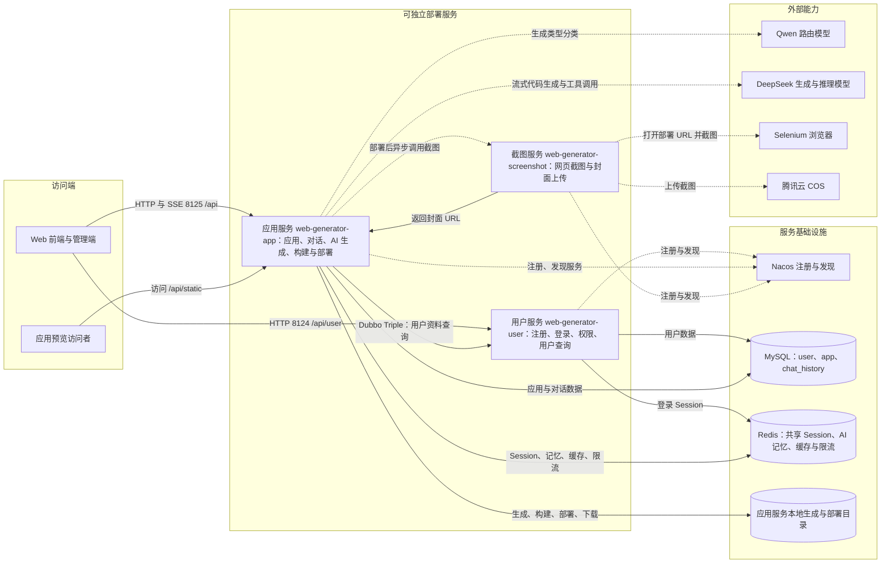

# 微服务业务架构图

范围：仓库 `microservice` 目录。根据启动类和 Dubbo 配置，当前存在 3 个可独立运行的服务；仓库中没有 API 网关或消息队列模块，因此下图不虚构这些组件。



## 服务边界

- 用户服务：HTTP 端口 `8124`，Dubbo Triple 端口 `50051`；负责用户和登录 Session，并向应用服务提供内部用户查询接口。
- 应用服务：HTTP 端口 `8125`，Dubbo Triple 端口 `50053`；承载应用、对话历史、AI 代码生成、构建、部署、下载和静态资源相关逻辑。
- 截图服务：HTTP 端口 `8127`，Dubbo Triple 端口 `50052`；通过 Selenium 截取部署页面，上传到 COS 后返回 URL。

`common`、`model`、`client` 和 `ai` 是 Maven 共享模块，不包含独立启动类。其中 `ai` 作为依赖运行在应用服务进程内，`client` 只定义 Dubbo 内部服务契约。

## 关键调用链

- 登录链路：前端调用用户服务，用户数据写入 MySQL，登录状态写入共享 Redis Session。
- 生成链路：前端调用应用服务，应用服务读取 Session、校验应用权限、调用 AI 模型并通过 SSE 返回结果，同时写入对话历史和本地代码目录。
- 部署链路：应用服务构建并复制发布产物，随后在虚拟线程中通过 Dubbo 调用截图服务；截图服务上传封面到 COS，应用服务再把封面 URL 写回 MySQL。

## 数据目录约定

单体服务和微服务的启动工作目录不同（仓库根目录 / `microservice` 目录），因此生成目录和部署目录都不直接用 `user.dir` 拼接，而是由 `ProjectPathUtils` 从工作目录逐级向上定位仓库根（标记：同时存在 `pom.xml` 和 `microservice/pom.xml`），保证两种启动方式读写同一份数据：

| 目录 | 取值 | 说明 |
|------|------|------|
| 生成目录 `AppConstant.CODE_OUTPUT_ROOT_DIR` | `<仓库根>/tmp/code_output` | 生成的源码、Vue 构建产物 |
| 部署目录 `AppConstant.CODE_DEPLOY_ROOT_DIR` | `<仓库根>/tmp/code_deploy` | **必须和 nginx 容器挂载的宿主机目录完全一致** |

目录不一致时的表现：部署接口返回成功、数据库也写入了 deployKey，但访问部署地址时 nginx 找不到该目录，返回 `404 Not Found`。

需要改成其他目录时（优先级从高到低，均会覆盖自动定位的结果）：

1. 环境变量 `CODE_DEPLOY_DIR` / `CODE_OUTPUT_DIR`
2. 启动参数 `-Dcode.deploy.dir` / `-Dcode.output.dir`
3. `microservice/app/src/main/resources/application.yml` 中的 `code.deploy-dir`

也可以反过来让 nginx 挂载同一个目录：

```bash
docker run -d -p 80:80 -v /your/path/tmp/code_deploy:/usr/share/nginx/html nginx
```

应用服务启动时会打印实际使用的生成目录和部署目录，每次部署成功时也会打印一次，便于确认两种启动方式是否指向同一目录。

## 代码依据

- `microservice/pom.xml`
- `microservice/app/src/main/java/com/zy/webgenerator/WebGeneratorAppApplication.java`
- `microservice/app/src/main/java/com/zy/webgenerator/service/impl/AppServiceImpl.java`
- `microservice/app/src/main/resources/application.yml`
- `microservice/common/src/main/java/com/zy/webgenerator/utils/ProjectPathUtils.java`
- `microservice/user/src/main/java/com/zy/webgenerator/WebGeneratorUserApplication.java`
- `microservice/user/src/main/java/com/zy/webgenerator/service/impl/InnerUserServiceImpl.java`
- `microservice/screenshot/src/main/java/com/zy/webgenerator/WebGeneratorScreenshotApplication.java`
- `microservice/screenshot/src/main/java/com/zy/webgenerator/service/impl/InnerScreenshotServiceImpl.java`
- `microservice/client/src/main/java/com/zy/webgenerator/innerservice`
- 各服务的 `src/main/resources/application.yml` 与 `application-local.yml`
