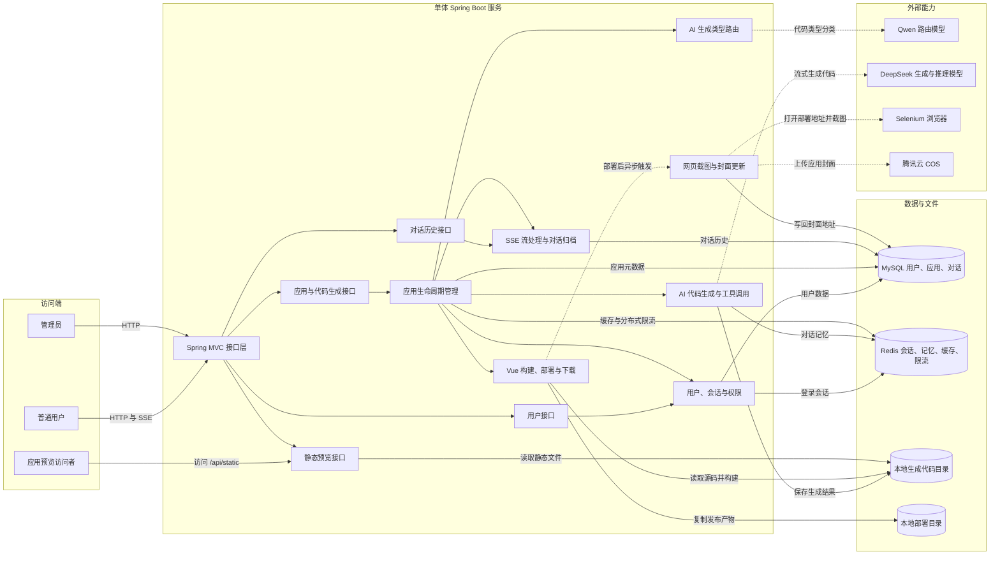

# 单体服务业务架构图

范围：仓库根目录 `src`。运行边界是一个 Spring Boot 应用 `yu-ai-code-mother-backend`，默认端口为 `8123`，上下文路径为 `/api`。

## 主要业务链路

- 创建应用：用户提交初始提示词，应用服务调用路由模型选择 `HTML`、`MULTI_FILE` 或 `VUE_PROJECT`，再保存应用元数据。
- 对话生成：应用服务校验所有权、记录用户消息，代码生成外观调用大模型并通过 SSE 返回内容；完整结果被解析并保存到本地代码目录。
- 部署应用：应用服务按生成类型读取源码；Vue 项目先执行构建，再把产物复制到部署目录，并异步生成截图上传到 COS。
- 查询管理：用户、应用和对话历史统一通过单体接口层访问 MySQL；Redis 同时承担 Session、AI 对话记忆、缓存和限流状态。

## 代码依据

- `src/main/java/com/zy/webgenerator/controller`
- `src/main/java/com/zy/webgenerator/service/impl/AppServiceImpl.java`
- `src/main/java/com/zy/webgenerator/core/AiCodeGeneratorFacade.java`
- `src/main/java/com/zy/webgenerator/ai/AiCodeGeneratorServiceFactory.java`
- `src/main/java/com/zy/webgenerator/core/handler/StreamHandlerExecutor.java`
- `src/main/java/com/zy/webgenerator/service/impl/ScreenshotServiceImpl.java`
- `src/main/resources/application.yml`

`langgraph4j` 包中的工作流实现未发现被 Controller 或 `AppServiceImpl` 直接调用，因此没有虚构它与主请求链路的连接；其内部结构见独立的[工作流业务架构图](langgraph4j-workflow-architecture.md)。
